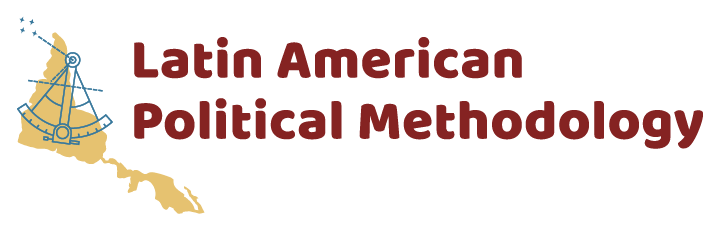
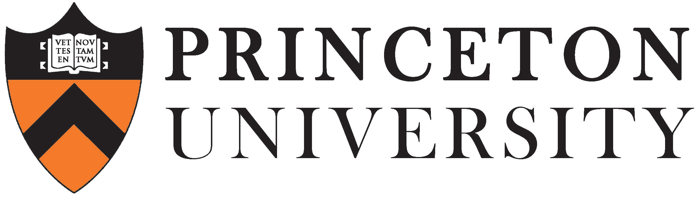

<a href="#register">Register</a> | <a href="#program">Program</a> | <a href="#logistics">Logistics</a>
---
 

# Latin American Political Methodology Meeting

Welcome! We are excited to announce the fourth Latin American PolMeth meeting. The event will take place on November 17 -- 20 of 2020 in Degy World, a virtual conference campus. It is hosted by the Universidade de Sāo Paulo, with support from the Society for Political Methodology, Princeton University, and the University of North Carolina at Chapel Hill. 

The meeting will feature paper workshops, a poster session for graduate students, and keynote talks by prominent political methodologists, including SPM president [Suzzana Linn](https://polisci.la.psu.edu/people/sld8) (Penn State), [Arthur Spirling](http://arthurspirling.org/) (NYU), and [Noam Lupu](https://www.noamlupu.com/) (Vanderbilt). 

## Apply
Applications are now **closed**. 

## Register
Registration for this event is free for SPM members. To become a member, and to register for the event, please visit our [Cambridge Core Registration Site](https://www.cambridge.org/core/membership/spm/register).

## Program

The final program for this year's event can be found [here](https://docs.google.com/document/d/1g3Gp3DQSsi9rdl38dmrmW0lBQrLWCJANthXh-JLmXlU/edit?usp=sharing). All times are given in Eastern Time (U.S.).  

## Logistics

### Meeting location
To acommodate conditions brought about by the COVID-19 pandemic, we have moved our entire event to a virtual conference space managed by [Degy World](https://www.degy.com/degy-world/). The digital space, based on the [VirBela](https://www.virbela.com/) platform, offers an immersive 3D experience that can facilitate interactions similar to those we would have in an in-person event. 

**The platform requires installation of a native application**. All registered participants will recieve instructions on how to download and use the application once registration closes. 

**Poster presenters will receive additional information on how to format their posters** for an optimal experience in our virtual expo hall.  

### Event format
The event will feature **hour-long, parallel paper workshops**, which will be restricted to registered participants. During these sessions, previously circulated manuscipts will be actively discussed, and **no presentation will take place**. It is therefore imperative that **all participants read the papers in advance**, and prepare feedback to ensure a lively and engaging discussion. In order to avoid online fatigue, we have distributed workshops across three days, with a morning and an afternoon session on each day. 

The event will also feature three keynote presentations, and a poster session November 20th.  

All talks and sessions will be held in English.

### Organizing team

- Santiago López Cariboni (Universidad Católica del Uruguay)
- Carmen Le Foulon (Universidad Católica de Chile)
- Lorena Barberia (Universidade de São Paulo)
- Santiago Olivella (University of North Carolina at Chapel Hill, USA)

### Sponsors

 

